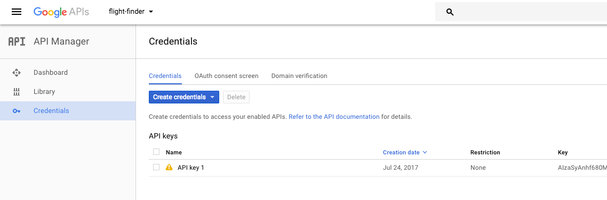
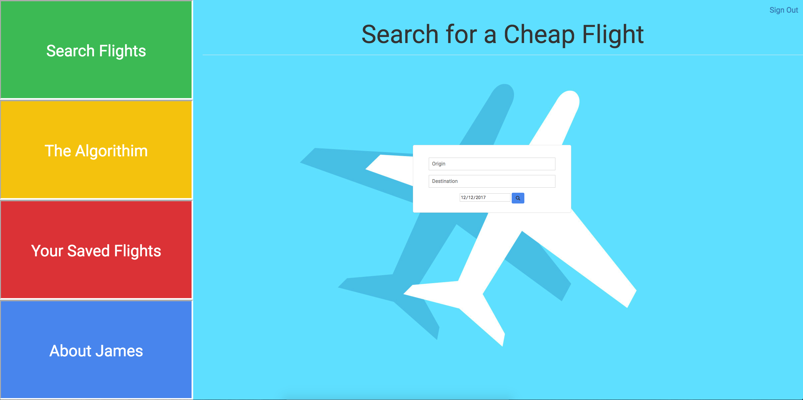
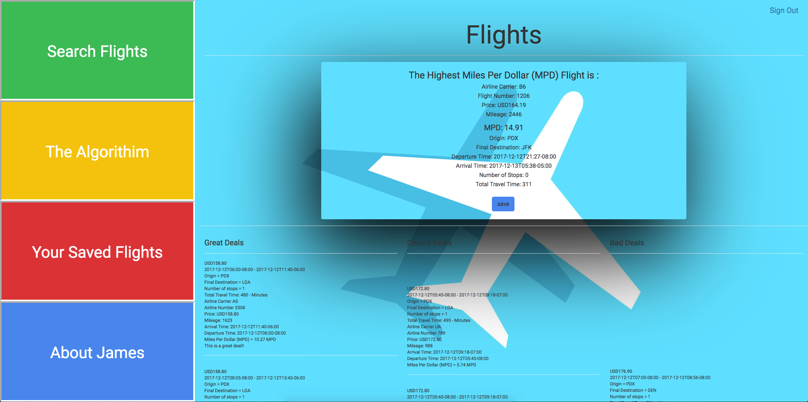
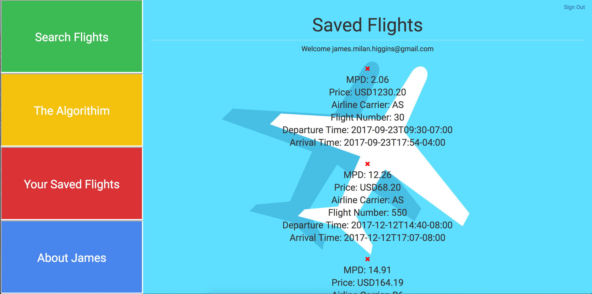

<h1 align="center">
James' Cheap Flights Finder
</h1>

#### _This applications finds cheap flights_

Visit Live Hosted Site On Heroku [here](https://james-cheap-flights.herokuapp.com/)

#### By _**James Higgins**_

## How To Use


* _Ensure connection to the Internet_
* _On a mac using spotlight search, type in terminal_
* _Once in terminal enter the following commands to clone the file to your desktop and open the repository:_
```
$ cd desktop
$ git clone https://github.com/jamesmilanhiggins/Google-Flights
$ cd Google-Flights
$ touch .env
$ atom .
Get an API key for [QPX EXPRESS API](https://developers.google.com/qpx-express/v1/prereqs)
Open the .env file and add "GOOGLE_FLIGHTS_API_KEY=[YOUR API KEY HERE]"
$ bundle
$ rake db:setup
$ rails s
$ open localhost:3000 in your browser

```
 or view live site [here](https://james-cheap-flights.herokuapp.com/)


## API Info

 * This project uses [QPX Express API](https://developers.google.com/qpx-express/).
 * You need a [Google Account](https://accounts.google.com/SignUp?continue=https%3A%2F%2Faccounts.google.com%2FManageAccount) in order to [create a project](https://developers.google.com/qpx-express/v1/prereqs#project) in the Google API Console. If you already have an account, then you're all set.
 * Note: Google only gives each API Key 50 free calls per day.

 

## Known Bugs

 * There are no known bugs at this time

## Future Features Coming Soon

 * Test Custom Routes and API Call
 * Show list of Airport codes
 * Callback to upcased all inputted airport codes
 * More Developed User Accounts
 * Change from One way to Round-Trip


## Support and contact details

 _Please contact James Higgins at James.Milan.Higgins@gmail.com if you have any questions or ideas._

## Technologies Used

 * Ruby
 * Rails

### License

 *This software is licensed under MIT license.*

Copyright (c) 2017 **_James Higgins_**

 
 
 
